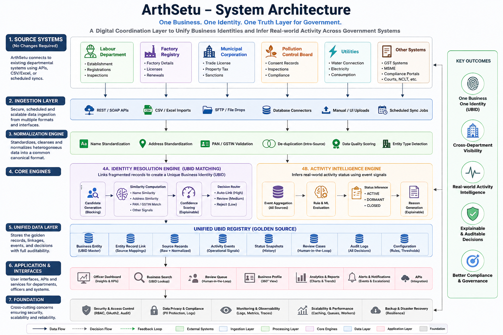
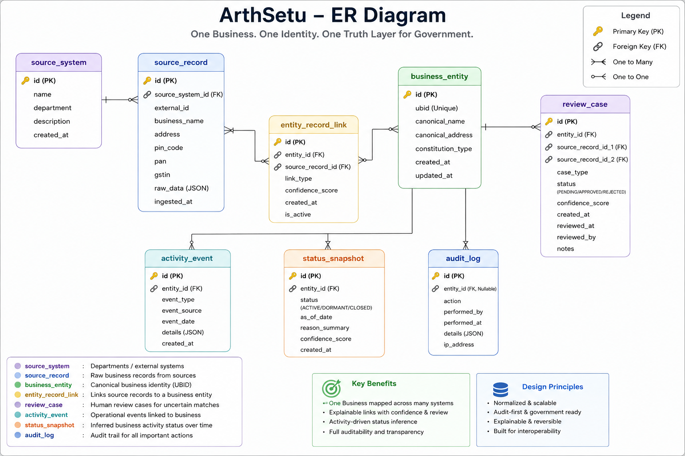
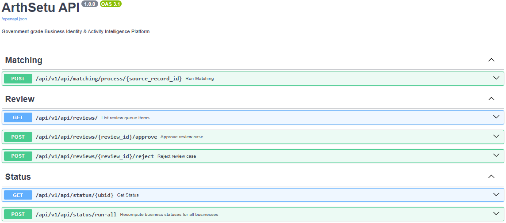
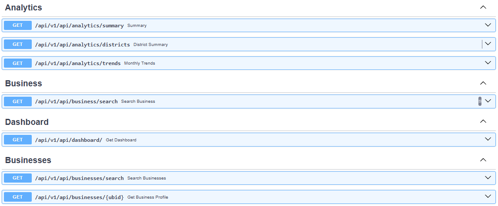
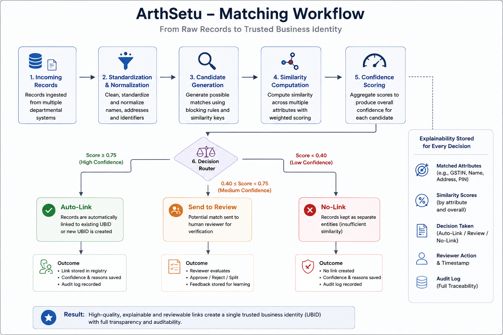

# ArthSetu
#### A platform which provides Unified Business Intelligence Infrastructure for Indian Government

 
### *One Business. One Identity. One Truth Layer for Government.*

<p align="center">
  
  
  
  
  
</p>

---

# Executive Summary

ArthSetu is a government-grade **Business Identity & Activity Intelligence Platform** designed to solve one of the most critical administrative problems in public governance:

> The absence of a trusted, unified business identity across fragmented departmental systems.

Today, the same business often exists separately in:

- Labour Department databases  
- Factory Registries  
- Municipal Licensing Systems  
- Pollution Control Boards  
- Utility Records  
- Compliance Portals  

Each department stores business data differently, resulting in:

- Duplicate records  
- Fragmented identities  
- Manual reconciliation effort  
- Poor compliance targeting  
- Delayed closure detection  
- Weak inter-department coordination  
- Inaccurate policy intelligence  

ArthSetu creates a **Unique Business Identifier (UBID)** for every real-world business and continuously determines whether the business is:

- **Active**
- **Dormant**
- **Closed**

—all while ensuring every decision remains:

- Explainable  
- Reviewable  
- Reversible  
- Government-feasible  

---

# Why ArthSetu Matters

## The Real Problem Is Not Just Duplicate Data

The actual problem is:

- No shared identity layer
- No operational truth
- No cross-department visibility
- No trustworthy business lifecycle intelligence

### Example

The same factory may appear as:

| Department | Record |
|---|---|
| Labour | Punjab Steel Works Pvt Ltd |
| Municipal | Punjab Steel Wrks Pvt. Ltd. |
| Pollution | PUNJAB STEEL INDUSTRIES |
| Utility | Punjab Steel Works |

No officer can instantly confirm:

> “Are these the same business?”

ArthSetu solves this.

---

# Vision

ArthSetu acts as a **Digital Coordination Layer** above existing government systems without replacing them.

It enables governments to answer queries like:

```sql
SELECT *
FROM factories
WHERE status = 'ACTIVE'
AND last_inspection > 18 months;
```

within seconds instead of weeks.

---

# Core System Capabilities

# 1. UBID Identity Resolution Engine

ArthSetu intelligently links fragmented business records across multiple systems into a single trusted identity.

## Supported Matching Signals

### Strong Anchors

- GSTIN
- PAN

### Similarity Signals

- Business name similarity
- Address similarity
- PIN code
- Contact patterns
- Entity naming patterns

---

## Explainable Matching

Every linkage stores:

- Confidence score
- Evidence signals
- Reviewer action
- Timestamp
- Reversibility metadata

### Example Decision

```json
{
  "decision": "AUTO_LINK",
  "confidence": 0.94,
  "reasons": [
    "GSTIN exact match",
    "Name similarity 0.96",
    "PIN code match"
  ]
}
```

---

# 2. Human-in-the-Loop Governance

ArthSetu never silently merges uncertain records.

Instead:

| Confidence | Action |
|---|---|
| High | Auto-Link |
| Medium | Send to Review Queue |
| Low | Keep Separate |

---

## Reviewer Workflow

Reviewers can:

- Approve merges
- Reject merges
- Split wrongly linked entities
- Override classifications
- Reassign activity events

Every action becomes feedback for future calibration.

---

# 3. Business Activity Intelligence Engine

A registered business is not necessarily an operational business.

ArthSetu continuously evaluates:

- Inspections
- Filings
- Licence renewals
- Utility activity
- Compliance submissions
- Closure notices

to infer:

## ACTIVE

Recent operational signals detected.

## DORMANT

Historical existence but weak recent activity.

## CLOSED

Explicit closure or prolonged inactivity.

---

## Explainable Status Decisions

### Example

```yaml
Status: Dormant

Reasons:
  - No filings in 14 months
  - No inspections in 16 months
  - Utility activity below threshold
```

---

# 4. Government Interoperability Layer

ArthSetu was specifically designed around real-world government constraints.

## No Source System Changes Required

Departments continue using existing systems.

ArthSetu integrates using:

- APIs
- CSV exports
- Scheduled syncs
- Read-only connectors

This makes deployment realistic.

---

# System Architecture
Docs/

<p align="center">
  
</p>

```text
┌─────────────────────────────────────────────┐
│         Government Department Systems       │
│ Labour │ Municipal │ Pollution │ Utilities │
└─────────────────────────────────────────────┘
                      │
                      ▼
┌─────────────────────────────────────────────┐
│              Ingestion Layer                │
│ APIs │ CSV Imports │ Connectors │ Sync Jobs │
└─────────────────────────────────────────────┘
                      │
                      ▼
┌─────────────────────────────────────────────┐
│            Normalization Engine             │
│ Name Cleaning │ Address Standardization     │
└─────────────────────────────────────────────┘
                      │
          ┌───────────┴───────────┐
          ▼                       ▼
┌───────────────────┐   ┌────────────────────┐
│ Identity Engine   │   │ Activity Engine    │
│ UBID Matching     │   │ Status Inference   │
└───────────────────┘   └────────────────────┘
          │                       │
          └───────────┬───────────┘
                      ▼
┌─────────────────────────────────────────────┐
│             Unified UBID Registry           │
└─────────────────────────────────────────────┘
                      │
                      ▼
┌─────────────────────────────────────────────┐
│ Dashboard │ Search │ Review Queue │ APIs    │
└─────────────────────────────────────────────┘
```

---

# Technology Stack

## Backend

- Python
- FastAPI
- SQLAlchemy 2.0
- Alembic
- Pydantic

## Database

- SQLite (development)
- PostgreSQL-ready architecture

## Matching & Intelligence

- RapidFuzz
- Weighted Rule Engine
- Explainable Confidence Scoring
- Reviewer Feedback Calibration

## Frontend

- React
- Vite
- TailwindCSS

## Infrastructure

- Docker + docker-compose (Postgres, API, nginx-served frontend)
- In-process background job runner for batch/bulk operations
- Modular backend services
- REST APIs

---

# Database Design

ArthSetu uses a normalized relational architecture.

## Core Tables

| Table | Purpose |
|---|---|
| source_system | Department registry metadata |
| source_record | Raw fragmented business records |
| business_entity | Canonical UBID entity |
| entity_record_link | Mapping source records to UBID |
| review_case | Human review queue |
| activity_event | Operational activity signals |
| status_snapshot | Business lifecycle classifications |
| audit_log | Explainability and governance tracking |

---

### ER DIAGRAM

<p align="center">
  
</p>

# Current Prototype Status

## Backend Platform

### Completed

- FastAPI backend
- Database schema
- Alembic migrations
- Identity engine
- Explainable matching
- Activity inference
- Review APIs
- Synthetic ecosystem
- Analytics endpoints

---

## Frontend

React + TypeScript console (Vite + Tailwind, TanStack Query). Complete:

- **Authentication** — login, JWT session, route guards, role-gated UI, admin user management
- **Data ingestion** (admin) — CSV import with loose header matching, records run through
  the matching engine on upload, "process pending" for unresolved records
- **Executive dashboard** — KPIs, activity-trend chart, status breakdown, live audit feed
- **Business search** — full-text + status/district filters, URL-synced, paginated
- **Business profile** — identity, linked departmental records, matching evidence,
  activity timeline, explainable status inference, per-business audit trail
- **Review queue** — human-in-the-loop approve / reject with real link confirmation,
  reviewer attribution
- **Corrections** — split a wrongly-linked record, pin a lifecycle status, reassign an
  activity event; every correction is reversible from a history view
- **District analytics** — stacked bars + sortable table with drill-down into search
- **Background jobs** (admin) — batch status recompute and bulk matching now run off the
  request thread on a worker pool; a Jobs page tracks pending/running/succeeded/failed
- **Matching tuning** (admin) — the scoring weights and decision thresholds are live-editable
  (no longer fixed constants), alongside a reviewer-feedback calibration view that buckets
  review-case confidence against actual approve/reject outcomes

---

# Synthetic Sandbox Ecosystem

To simulate real government environments, ArthSetu includes a realistic synthetic ecosystem.

## Current Dataset

| Component | Count |
|---|---|
| Source Systems | 4 |
| Businesses | 300 |
| Source Records | 763 |
| Linked Records | 708 |
| Review Cases | 325 |
| Activity Events | 2623 |
| Status Snapshots | 300 |
| Audit Logs | 705 |

---

## Synthetic Realism Included

- Spelling variations
- Missing PAN/GSTIN
- Noisy addresses
- Intra-department duplicates
- Ambiguous identities
- Realistic activity histories

---

# APIs

<p align="center">
  
</p>


<p align="center">
  
</p>


## Matching Engine

<p align="center">
  
</p>

```http
POST /api/v1/matching/process/{id}
```

Processes incoming records.

---

## Review Queue

```http
GET /api/v1/review
```

Returns pending review cases.

---

## Approve / Reject Review

```http
POST /api/v1/review/{id}/approve
POST /api/v1/review/{id}/reject
```

---

## Business Search

```http
GET /api/v1/business/search?q=
```

Search using:

- UBID
- GSTIN
- PAN
- Business name

---

## Status Engine

```http
GET /api/v1/status/{id}
```

Returns operational status.


# Real-World Impact Estimates

| Capability | Estimated Improvement |
|---|---|
| Manual reconciliation reduction | 70–85% |
| Duplicate record reduction | 60–75% |
| Faster closure detection | 90–180 days |
| Reviewer workload reduction | 65–80% |
| Compliance targeting efficiency | 40–60% |

---

# Why ArthSetu Is Different

Most solutions solve only one layer:

- Matching tool
- Dashboard
- Analytics engine
- Integration middleware

ArthSetu combines:

- Identity Resolution  
- Explainable AI  
- Human Governance  
- Activity Intelligence  
- Interoperability  

into one deployable ecosystem.

---

# Security & Governance

ArthSetu was designed with government trust requirements in mind.

## Principles

- Explainable decisions
- Audit trails
- Reversible merges
- No silent automation
- Sandbox compatibility
- No hosted LLM dependency on raw PII

---

# Scalability Vision

ArthSetu can evolve into:

- Statewide business intelligence infrastructure
- Compliance targeting engine
- Fraud detection layer
- MSME operational intelligence network
- National interoperable business identity layer

---

# Repository Structure

```bash
ArthSetu/
│
├── backend/
│   ├── app/            # FastAPI app: api / services / db / schemas
│   └── seed_dev.py     # self-contained synthetic-data seeder
├── frontend/           # React + TypeScript + Vite console
├── migrations/         # Alembic migrations
├── Docs/
│   ├── API_CONTRACT.md # the v1 REST contract the frontend targets
│   └── architecture/
└── README.md
```

---

# Setup Instructions

Run everything from the repository root.

## Backend

```bash
python -m venv .venv
.venv\Scripts\activate            # Windows  (source .venv/bin/activate elsewhere)
pip install -r backend/requirements.txt

python -m backend.seed_dev --reset          # build a local SQLite dataset
python -m uvicorn backend.app.main:app --reload
```

- API: `http://localhost:8000`  ·  Swagger: `http://localhost:8000/docs`
- DB defaults to `sqlite:///./arthsetu_dev.db`; set `DATABASE_URL` (e.g. Postgres)
  in `backend/.env` to override. Schema is managed by Alembic (`alembic upgrade head`).
- **Set `SECRET_KEY` in `backend/.env` for any non-local run**
  (`python -c "import secrets; print(secrets.token_urlsafe(48))"`).

## Frontend

```bash
cd frontend
npm install
npm run dev                        # http://localhost:5173
```

The dev server proxies `/api` to the backend, so start the API first. See
[`frontend/README.md`](frontend/README.md) for details.

## Docker

```bash
docker compose up --build
docker compose exec backend python -m backend.seed_dev --reset   # optional: synthetic demo data
```
Runs Postgres + the API (`:8000`, migrations applied on start) + the
frontend behind nginx (`:8080`). Works with zero config for a trial run —
a fresh container bootstraps one admin login (`admin` / `arthsetu-admin`
by default). For a real deployment, copy `.env.docker.example` to `.env`
and set `APP_ENV=production` plus real secrets; the backend refuses to
start in production with the default `SECRET_KEY` or bootstrap password.
See [`Docs/API_CONTRACT.md`](Docs/API_CONTRACT.md#running-with-docker) for
the full hardening notes (non-root containers, health checks, resource
limits, nginx security headers).

## Auth

Every API call except `/health` and `/auth/login` needs a bearer token.
Roles: **admin** > **reviewer** > **viewer** (see [`Docs/API_CONTRACT.md`](Docs/API_CONTRACT.md)).
The seeder creates demo accounts:

| Username | Password | Role |
|---|---|---|
| `admin` | `arthsetu-admin` | admin |
| `reviewer` | `arthsetu-review` | reviewer |
| `officer` | `arthsetu-view` | viewer |

## Tests

```bash
python -m pytest                    # backend — from the repo root
cd frontend && npm run test         # frontend (Vitest)
```

Backend covers the scoring/status/matching engines, JWT + password hashing, and
the authenticated API (roles, review flow, endpoint contracts). Frontend covers
the formatters, audit descriptions, and the auth context / route guard.

GitHub Actions (`.github/workflows/ci.yml`) runs both suites plus
`alembic upgrade head`, `tsc --noEmit`, and `vite build` on every push and PR.

---

# Evaluation Criteria Alignment

| Evaluation Area | ArthSetu Strength |
|---|---|
| Problem Understanding | Deep real-world government fragmentation analysis |
| Technical Innovation | Explainable matching + activity intelligence |
| Government Feasibility | No source system replacement needed |
| Demo Quality | Reviewer workflow + live matching engine |
| Scalability | Modular statewide interoperability platform |

---

# Future Roadmap

## Phase 1

- Frontend completion
- Dashboard polish
- Deployment hardening

## Phase 2

- ML-assisted calibration
- District heatmaps
- Anomaly detection

## Phase 3

- Statewide onboarding
- Distributed ingestion
- Compliance intelligence layer

---

# Final Statement

ArthSetu is not merely a registry.

It is a trusted intelligence layer that helps governments understand:

- Which businesses are truly the same
- Which are operational
- Where intervention is required
- Why the system reached that conclusion

---

# Team ArthSetu
###| Member | Role |
|---|---|
|AYUSH | AI & Backend Systems Engineer |
| PRANAY GUPTA | Platform & Data Infrastructure Engineer |
|ANIMESH | Product & Governance Workflow Engineer |

Building trustworthy digital public infrastructure for modern governance.
